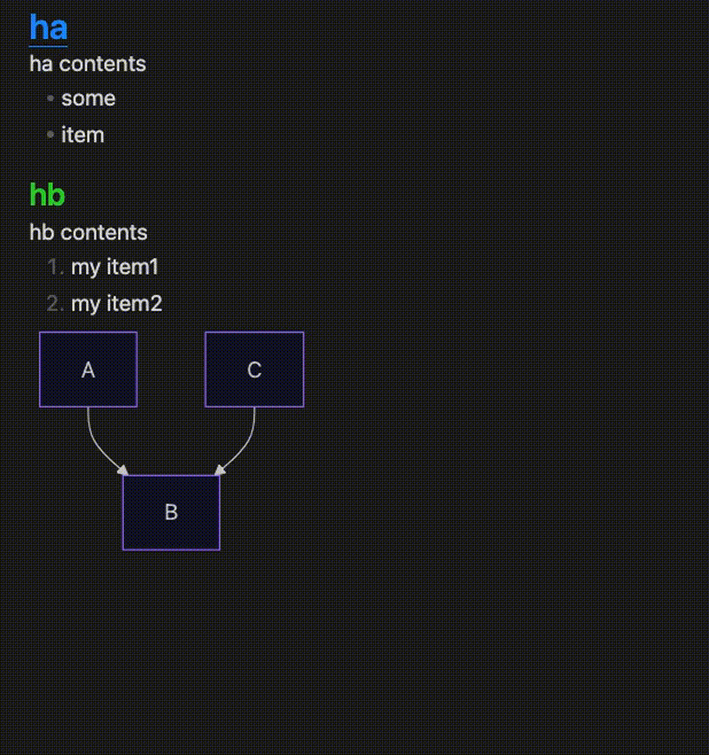

# Heading Level Changer

**Heading Level Changer** は、Obsidian のノート内で見出しレベル（# の数）を直感的に増減できるプラグインです。  
選択範囲がある場合はその範囲内の見出しを一括で処理し、選択されていない場合はカーソル行の見出しを変更します。

最新版では **実行後も選択範囲が外れないよう改善**されており、連続して見出しレベルを調整する操作が快適になりました。

## デモ



## 機能

- 見出しレベルの増減  
  Markdown の見出し (#) の数を 1 つ増減します。

- 選択範囲またはカーソル行に応じた処理  
  - 選択範囲がある場合：  
    選択された複数行を対象に、見出しレベルを一括で変更します。  
    実行後も選択範囲は維持されるため、連続操作が可能です。
  - 選択されていない場合：  
    カーソル行が見出しであれば、その行の見出しレベルを変更します。  
    カーソル位置は維持されます。

- 行頭スペース付き見出しは無視  
  例：
  ` ` ` `## Indented heading
  このような行は見出しとして扱わず、変更対象外になります。

- コマンドパレット対応  
  Increase Heading Level / Decrease Heading Level をコマンドパレットから実行可能。  
  任意のキーボードショートカットを割り当てられます。

- コンテキストメニュー対応  
  エディタの右クリックメニューからも実行できます。

- 繰り返し操作の場合、選択は実行後も保持されます。

## インストール

### ~~コミュニティプラグインから~~

1. ~~Obsidian を起動します。
2. ~~設定 > コミュニティプラグイン に移動します。~~
3. ~~Restricted mode（制限モード）が有効なら無効化します。~~
4. ~~Browse（閲覧）をクリックし、Heading Level Changer を検索します。~~
5. ~~プラグインをインストールし、有効化します。~~

### 手動インストール

1. GitHub Releases から ZIP をダウンロードします。
2. ZIP を解凍します。
3. 解凍したフォルダを以下のパスに配置します：  
   <your-vault>/.obsidian/plugins/heading-level-changer
4. Obsidian を再起動またはプラグインをリロードします。

## 使用方法

プラグインを有効化すると、以下の 2 つのコマンドが利用できます。

### 見出しレベルの増減

- Increase Heading Level  
- Decrease Heading Level

#### 選択範囲がある場合

選択された行のうち、見出しとして認識される行だけを処理します。  
実行後も選択範囲は維持されます。

#### 選択されていない場合

カーソル行が見出しであれば、その行の見出しレベルを変更します。  
カーソル位置は維持されます。

### 例

#### カーソルが見出し行にある場合

Increase Heading Level  

```markdown
    ## head  ->  ### head
```

Decrease Heading Level  

```markdown
    ## ha  ->  # ha  
    # hb   ->  # hb
```

#### 複数行を選択した場合

Increase の例  

```markdown
# ha  
abcd  
efg...  
## hb  
hijk  
lmn...  
```

->  

```markdown
## ha  
abcd  
efg...  
### hb  
hijk  
lmn...
```

Decrease の例（レベル 2,3 → レベル 1,2）  

```markdown
## ha  
abcd  
efg...  
### hb  
hijk  
lmn...  
```

->  

```markdown
# ha  
abcd  
efg...  
## hb  
hijk  
lmn...
```

Decrease の例（レベル 1,2 → レベル 1,1）  

```markdown
# ha  
abcd  
efg...  
## hb  
hijk  
lmn...  
```

->  

```markdown
# ha  
abcd  
efg...  
# hb  
hijk  
lmn...
```

## 開発

### 必要条件

- Node.js（v18 以降推奨）
- TypeScript
- esbuild（本プロジェクトに同梱）

### ビルド

```sh
git clone https://github.com/rifumi/heading-level-changer.git
cd heading-level-changer
npm install
npm run build
```

ビルド成果物は dist/ に出力されます。

### 開発モード（watch）

```sh
npm run dev
```

保存のたびに自動ビルドされます。

### テスト（Vitest）

```sh
npm run test
```

### 手動デプロイ

```sh
cp ./dist/* <your-vault>/.obsidian/plugins/heading-level-changer/
```

## ライセンス

MIT License

## 更新履歴（日本語）

### 2026-01-19 1.0.1

- 選択範囲が維持されるように改善
- 複数行処理の挙動を改善
